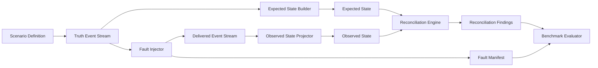

# FinReconLab

FinReconLab is an open-source reference implementation and experimental toolkit for deterministic reconciliation in event-driven financial transaction systems.

The repository is currently pre-alpha and contains only the project foundation and engineering charter. It does not contain a production-ready implementation, runnable application, package, benchmark result, or deployment artifact. Runnable instructions will be added with the first implementation milestone.

## Problem

Financial workflows often depend on multiple event handlers for orders, payments, refunds, shipping fees, commissions, and derived financial records. Each handler can appear successful in isolation while the overall transaction state becomes inconsistent because messages may be duplicated, delayed, missing, retried, processed out of order, or carry conflicting monetary values.

FinReconLab is intended to provide a controlled, synthetic implementation path for deterministic reconciliation. The core idea is to keep clean scenario truth separate from faulted delivery observations, then compare expected and observed financial state without allowing the reconciliation logic to know the injected faults.

## Intended Audience

- Backend engineers
- Platform engineers
- Fintech engineering teams
- E-commerce engineering teams
- Reliability engineers

## v0.1 Scenario

The first implementation milestone is expected to model a deterministic reconciliation workflow that can:

- Generate a versioned Scenario Definition.
- Build a deterministic Truth Event Stream.
- Derive Expected State from the Truth Event Stream.
- Inject duplicate, missing, delayed, out-of-order, and inconsistent-amount failures.
- Produce a Delivered Event Stream and Fault Manifest.
- Build Observed State from delivered events up to a logical Reconciliation Cutoff.
- Reconcile Expected State and Observed State.
- Produce stable Reconciliation Findings traceable to source and delivered events.

The Reconciliation Engine must never receive or access the Fault Manifest. The Fault Manifest is oracle data for tests and benchmark evaluation after reconciliation completes.

## Capabilities To Be Implemented

- Synthetic transaction-event generation with fixed seeds.
- Event vocabulary for `OrderPlaced`, `PaymentCaptured`, `RefundIssued`, `CommissionAssessed`, and `ShippingFeeAssessed`.
- Deterministic fault injection for known failure scenarios.
- Separate Expected State and Observed State construction.
- Logical Reconciliation Cutoff semantics.
- Expected-state versus observed-state reconciliation.
- Discrepancy classification with source-event and delivered-event traceability.
- Reproducible reconciliation reports.

## Non-Goals

- No production financial-processing system in the initial milestones.
- No use of real financial, personal, merchant, or customer data.
- No automatic mutation or repair of external systems in v0.1.
- No claims about performance, accuracy, adoption, or economic impact before evidence exists.
- No exchange-rate conversion in v0.1.
- No unnecessary microservice decomposition for v0.1.

## Roadmap Summary

- v0.1: deterministic reconciliation core.
- v0.2: event broker and persistence integration.
- v0.3: observability and repeatable benchmarks.
- v0.4: explainable anomaly assistance, only if deterministic baselines exist.

See [ROADMAP.md](docs/ROADMAP.md) for milestone acceptance criteria.

## Project Status

FinReconLab is in Phase 0: project foundation and engineering charter. It is not ready for production use and does not provide runnable implementation instructions yet.

## Contributing

Contributions are welcome once implementation work begins. See [CONTRIBUTING.md](CONTRIBUTING.md) for the contribution workflow and quality expectations.

## Security

Do not submit real financial data, personal data, secrets, credentials, or production incident details in issues, discussions, examples, or pull requests. See [SECURITY.md](SECURITY.md).

## License

FinReconLab is licensed under the [Apache License 2.0](LICENSE). See [NOTICE](NOTICE) for project copyright information.
