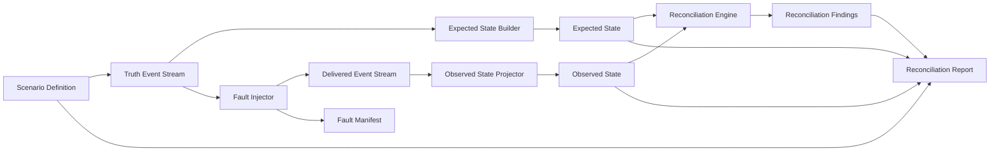

# FinReconLab

FinReconLab is intended to become an out-of-band projection-integrity and deterministic reconciliation toolkit for event-driven financial transaction systems.

The repository is pre-alpha. Its implemented v0.1 foundation is a narrow, tested, in-memory `PaymentCaptured` deterministic core. The operational worker and integrations described later in this document are planned and do not exist yet.

## Problem

Financial workflows often depend on multiple event handlers for orders, payments, refunds, shipping fees, commissions, and derived financial records. Each handler can appear successful in isolation while the overall transaction state becomes inconsistent because messages may be duplicated, delayed, missing, retried, processed out of order, or carry conflicting monetary values.

The implemented core provides a controlled synthetic path for deterministic reconciliation. The planned operational direction applies the same separation to an authoritative payment-event source and an observed payment projection through domain-specific adapters.

## Intended Audience

- Backend engineers
- Platform engineers
- Fintech engineering teams
- E-commerce engineering teams
- Reliability engineers

## Implemented v0.1 Core

The repository currently implements and tests a deterministic workflow that can:

- Generate a versioned Scenario Definition.
- Build a deterministic Truth Event Stream.
- Derive Expected State from the Truth Event Stream.
- Inject duplicate, missing, delayed, out-of-order, and inconsistent-amount failures.
- Produce a Delivered Event Stream and Fault Manifest.
- Build Observed State from delivered events up to a logical Reconciliation Cutoff.
- Reconcile Expected State and Observed State.
- Produce stable Reconciliation Findings traceable to source and delivered events.
- Serialize deterministic reconciliation evidence as a versioned report.



The Reconciliation Engine must never receive or access the Fault Manifest. The Fault Manifest is oracle data for tests and possible future benchmark evaluation after reconciliation completes.

### Implemented Capabilities

- .NET 10 solution with Domain and Application projects.
- Immutable `Money` value object using `decimal` amount and structural validation for an ISO 4217-style three-letter uppercase currency code.
- `PaymentCaptured` event with caller-supplied identity, order identity, money, logical sequence, and timestamp.
- Versioned `ScenarioDefinition` schema `payment-captured.v1` for deterministic `PaymentCaptured` truth-stream generation.
- Deterministic truth-stream generator using scenario id, unsigned seed, and one-based ordinal as an identity namespace.
- Delivered payment representation that preserves the clean source event and separately carries the amount observed in delivery, plus deterministic delivery sequence and delivery attempt.
- Expected payment projection from the clean truth event stream.
- Role-specific expected and observed payment snapshots with immutable, deterministically ordered contribution evidence.
- Deterministic duplicate-delivery, missing-delivery, delayed-delivery, out-of-order delivery, and inconsistent-amount delivery fault injectors that return delivered streams and separate Fault Manifests.
- Non-idempotent observed payment projection for the payment-delivery experiments.
- Payment reconciliation engine that compares role-specific expected and observed snapshots and emits both trace collections on captured-amount mismatch findings without receiving the Fault Manifest.
- Versioned `reconciliation-report.v1` contract and deterministic UTF-8 JSON serializer containing scenario configuration, cutoff, ordered snapshots, findings, and contribution traces without Fault Manifest data.
- Logical Reconciliation Cutoff based on a shared sequence boundary for expected and observed payment projections.
- xUnit tests for money semantics, scenario generation, delivery faults, traceability, report serialization, cutoff behavior, manifest isolation, and repeatability.

In the current v0.1 payment slices, baseline delivered events use the source event `LogicalSequence` as `DeliverySequence`. The same numeric cutoff can therefore align Expected State built from truth events and Observed State built from delivered events. Missing delivery preserves the sequence gap, delayed delivery moves the observed delivery position forward, and out-of-order delivery swaps two baseline delivery positions on the same synthetic sequence axis. Independent truth and transport timelines may require separate cutoff semantics in a future version.

## Planned Operational Direction

The initial operational reference use case is to incrementally compare expected state derived from an authoritative payment-event source with an observed payment projection, persist explainable reconciliation findings and versioned reports, and resume safely from explicit checkpoints.

The planned system runs outside the production transaction hot path:

- It does not replace the authoritative event source, existing projections, or existing consumers.
- It does not intercept or control production transaction processing.
- It does not assume that the authoritative source is an Event Store or a message broker.
- It accesses the authoritative source through a source-specific adapter, which may read a database, retained event source, approved export, replay interface, or another supported source.
- It accesses the observed projection through a domain-specific read adapter.
- It does not automatically understand arbitrary projection schemas or infer fault types from reconciliation evidence.
- Source and projection access should normally be read-only. FinReconLab writes only its own versioned reconciliation definitions, incremental expected state, checkpoints, findings, versioned reports, deterministic batch metadata, and other FinReconLab-owned operational metadata unless a future accepted ADR explicitly defines otherwise.

### Planned Usage Flow

1. Read authoritative source events through an adapter.
2. Read the observed projection through an adapter and establish a projection observation boundary comparable to the selected source high-watermark.
3. Process a bounded partition incrementally under an explicit versioned reconciliation definition.
4. Reconcile expected and observed state using the deterministic core.
5. Persist incremental expected state, findings, reports, batch metadata, and checkpoint progress atomically or through a tested replay-safe idempotent protocol.
6. Expose operational status and telemetry through later planned interfaces.

Before a planned operational run treats findings as final, its observed-projection adapter must prove that the projection processed through a source position comparable to the source high-watermark, provide an immutable equivalent as-of read, or apply an explicitly configured stabilization policy whose limitations are recorded. If comparability cannot be established, the run must be rejected, deferred, or marked provisional by a future tested contract rather than silently publishing a conclusive discrepancy. Wall-clock timestamps alone are not sufficient evidence.

The planned worker also requires FinReconLab-owned incremental expected state. Deterministic reducer state is persisted by reconciliation definition version, partition, and business identity, then updated from authoritative events in stable order. It remains distinct from the external observed projection. A batch cannot advance its checkpoint when expected-state or other required batch persistence fails, and replaying the same deterministic batch identity must not duplicate findings or reports.

The first runnable reference integration will use PostgreSQL with synthetic public data for the authoritative payment-event source, observed payment projection, explicit synthetic projection-processing checkpoint, incremental expected state, checkpoints, findings, reports, and batch metadata. PostgreSQL is a reference implementation rather than a universal requirement. RabbitMQ with MassTransit remains a possible later transport adapter; it is not mandatory and is not assumed to be the authoritative historical source.

## Build And Test

Requires .NET SDK `10.0.301` or a compatible .NET 10 patch version.

```bash
dotnet restore
dotnet build --no-restore
dotnet test --no-build
```

## Not Available Yet

- Authoritative-source or observed-projection adapter contracts.
- Incremental orchestration, versioned reconciliation definitions, comparable source and projection boundaries, partitioning, or persisted worker checkpoints.
- Incremental expected-state persistence or atomic and replay-safe batch completion.
- A runnable worker, API, or CLI.
- PostgreSQL integration or persistent findings and reports.
- RabbitMQ, MassTransit, Docker Compose, Testcontainers, or OpenTelemetry integration.
- Benchmark implementation, benchmark results, deployment support, external pilot, or production-ready behavior.
- Event vocabulary beyond `PaymentCaptured` and discrepancy classification beyond captured-amount mismatch.

## Non-Goals

- No production financial-processing system in the initial milestones.
- No use of real financial, personal, merchant, or customer data.
- No automatic mutation or repair of external systems in v0.1.
- No replacement of authoritative sources, existing projections, or production consumers.
- No claims about performance, accuracy, adoption, or economic impact before evidence exists.
- No exchange-rate conversion in v0.1.
- No unnecessary microservice decomposition for v0.1.
- No assumption that one generic adapter can understand arbitrary financial projections.

## Roadmap Summary

- v0.1: deterministic reconciliation core.
- v0.2: operational reconciliation contracts.
- v0.3: runnable PostgreSQL reference vertical slice.
- v0.4: scale, recovery, and observability.
- v0.5: preview release and external technical validation.

See [ROADMAP.md](docs/ROADMAP.md) for milestone acceptance criteria.

## Project Status

FinReconLab is pre-alpha and not ready for production use. v0.1 provides the reusable deterministic `PaymentCaptured` core; the operational adapters, worker, persistence, interfaces, recovery behavior, and telemetry remain planned.

## Contributing

Contributions are welcome. See [CONTRIBUTING.md](CONTRIBUTING.md) for the contribution workflow and quality expectations.

## Security

Do not submit real financial data, personal data, secrets, credentials, or production incident details in issues, discussions, examples, or pull requests. See [SECURITY.md](SECURITY.md).

## License

FinReconLab is licensed under the [Apache License 2.0](LICENSE). See [NOTICE](NOTICE) for project copyright information.
