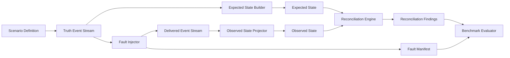

# FinReconLab

FinReconLab is an open-source reference implementation and experimental toolkit for deterministic reconciliation in event-driven financial transaction systems.

The repository is currently pre-alpha. It contains the project foundation plus the first deterministic duplicate-payment reconciliation vertical slice. It does not contain a production-ready implementation, runnable service, benchmark result, deployment artifact, API endpoint, database integration, message broker integration, or Docker setup.

## Problem

Financial workflows often depend on multiple event handlers for orders, payments, refunds, shipping fees, commissions, and derived financial records. Each handler can appear successful in isolation while the overall transaction state becomes inconsistent because messages may be duplicated, delayed, missing, retried, processed out of order, or carry conflicting monetary values.

FinReconLab is intended to provide a controlled, synthetic implementation path for deterministic reconciliation. The core idea is to keep clean scenario truth separate from faulted delivery observations, then compare expected and observed financial state without allowing the reconciliation logic to know the injected faults.

## Intended Audience

- Backend engineers
- Platform engineers
- Fintech engineering teams
- E-commerce engineering teams
- Reliability engineers

## v0.1 Scenario

The first implementation milestone is expected to model a deterministic reconciliation workflow that can:

- Generate a versioned Scenario Definition.
- Build a deterministic Truth Event Stream.
- Derive Expected State from the Truth Event Stream.
- Inject duplicate, missing, delayed, out-of-order, and inconsistent-amount failures.
- Produce a Delivered Event Stream and Fault Manifest.
- Build Observed State from delivered events up to a logical Reconciliation Cutoff.
- Reconcile Expected State and Observed State.
- Produce stable Reconciliation Findings traceable to source and delivered events.



The Reconciliation Engine must never receive or access the Fault Manifest. The Fault Manifest is oracle data for tests and benchmark evaluation after reconciliation completes.

## Implemented In The First Vertical Slice

- .NET 10 solution with Domain and Application projects.
- Immutable `Money` value object using `decimal` amount and structural validation for an ISO 4217-style three-letter uppercase currency code.
- `PaymentCaptured` event with caller-supplied identity, order identity, money, logical sequence, and timestamp.
- Versioned `ScenarioDefinition` schema `payment-captured.v1` for deterministic `PaymentCaptured` truth-stream generation.
- Deterministic truth-stream generator using scenario id, unsigned seed, and one-based ordinal as an identity namespace.
- Delivered payment representation with source event identity, deterministic delivery sequence, and delivery attempt.
- Expected payment projection from the clean truth event stream.
- Deterministic duplicate-delivery fault injector that returns a delivered stream and separate Fault Manifest.
- Non-idempotent observed payment projection for the duplicate-delivery experiment.
- Payment reconciliation engine that compares expected and observed snapshots without receiving the Fault Manifest.
- Logical Reconciliation Cutoff based on delivery sequence.
- xUnit tests for money semantics, duplicate delivery, cutoff behavior, manifest isolation, and repeatability.

## Build And Test

Requires .NET SDK `10.0.301` or a compatible .NET 10 patch version.

```bash
dotnet restore
dotnet build --no-restore
dotnet test --no-build
```

## Capabilities Still To Be Implemented

- Synthetic generation beyond the narrow `PaymentCaptured` scenario definition.
- Event vocabulary beyond `PaymentCaptured`: `OrderPlaced`, `RefundIssued`, `CommissionAssessed`, and `ShippingFeeAssessed`.
- Fault types beyond duplicate `PaymentCaptured` delivery.
- Complete separate Expected State and Observed State construction across the v0.1 event vocabulary.
- Discrepancy classification with source-event and delivered-event traceability.
- Reproducible reconciliation reports.

## Non-Goals

- No production financial-processing system in the initial milestones.
- No use of real financial, personal, merchant, or customer data.
- No automatic mutation or repair of external systems in v0.1.
- No claims about performance, accuracy, adoption, or economic impact before evidence exists.
- No exchange-rate conversion in v0.1.
- No unnecessary microservice decomposition for v0.1.

## Roadmap Summary

- v0.1: deterministic reconciliation core.
- v0.2: event broker and persistence integration.
- v0.3: observability and repeatable benchmarks.
- v0.4: explainable anomaly assistance, only if deterministic baselines exist.

See [ROADMAP.md](docs/ROADMAP.md) for milestone acceptance criteria.

## Project Status

FinReconLab is pre-alpha and not ready for production use. The current implementation is a narrow deterministic `PaymentCaptured` scenario-generation and duplicate-payment reconciliation slice intended to establish core design constraints.

## Contributing

Contributions are welcome. See [CONTRIBUTING.md](CONTRIBUTING.md) for the contribution workflow and quality expectations.

## Security

Do not submit real financial data, personal data, secrets, credentials, or production incident details in issues, discussions, examples, or pull requests. See [SECURITY.md](SECURITY.md).

## License

FinReconLab is licensed under the [Apache License 2.0](LICENSE). See [NOTICE](NOTICE) for project copyright information.
