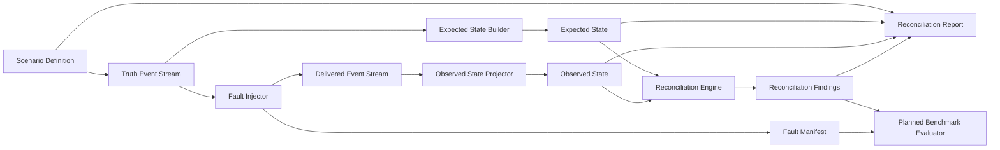
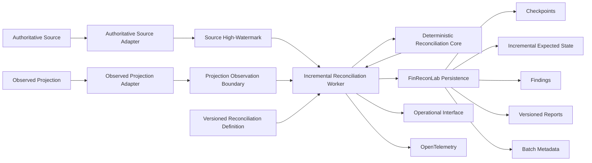

# Architecture

This document distinguishes the implemented v0.1 deterministic `PaymentCaptured` core from the planned out-of-band operational reference architecture.

## Technology Status

Implemented:

- .NET 10
- C#
- xUnit

Planned and requiring future ADRs before implementation:

- PostgreSQL
- OpenTelemetry
- Docker Compose
- Testcontainers
- BenchmarkDotNet
- RabbitMQ with MassTransit as an optional later transport adapter

## Currently Implemented Slice

The repository currently implements narrow deterministic `PaymentCaptured` reconciliation slices:

- .NET 10 solution with Domain and Application projects.
- `Money` value object with `decimal` amount and structural validation for an ISO 4217-style three-letter uppercase currency code.
- `PaymentCaptured` event with caller-supplied event id, order id, captured amount, logical sequence, and timestamp.
- `payment-captured.v1` Scenario Definition and deterministic truth-stream generator for `PaymentCaptured` events.
- Delivered payment representation that preserves the clean source event and separately carries the amount observed in delivery, plus deterministic delivery sequence and delivery attempt.
- Expected payment projection from the clean truth event stream into an `ExpectedPaymentSnapshot` with ordered source contributions.
- Deterministic duplicate-delivery, missing-delivery, delayed-delivery, out-of-order delivery, and inconsistent-amount delivery fault injectors that return delivered streams and separate Fault Manifests.
- Non-idempotent observed payment projection into an `ObservedPaymentSnapshot` with ordered delivered contributions.
- Reconciliation Engine that receives only role-specific expected and observed payment snapshots and emits both contribution traces on mismatch findings.
- `reconciliation-report.v1` contract and deterministic JSON serializer for ordered scenario configuration, cutoff, snapshot, finding, and contribution evidence.
- Logical Reconciliation Cutoff based on a shared sequence boundary for expected and observed payment projections.
- xUnit tests for the implemented slice.

The implemented slice does not include operational adapters, an incremental worker, checkpoint persistence, partitioning, additional event types, explicit missing-record finding classification, API or CLI interfaces, PostgreSQL, RabbitMQ, MassTransit, Docker, OpenTelemetry, benchmark execution, deployment support, or production-ready behavior.

## Architectural Direction

FinReconLab is intended to become an out-of-band projection-integrity and deterministic reconciliation toolkit. The operational system runs separately from the production transaction hot path and does not replace or control the authoritative event source, existing projections, or production consumers.

The deterministic Domain and Application core must remain independent of PostgreSQL, brokers, hosting, telemetry, container orchestration, and serialization infrastructure. Operational orchestration and infrastructure adapters should remain at explicit outer boundaries. Unnecessary services and decorative infrastructure should be avoided.

## Required Data Flow

The Reconciliation Engine must never receive or access the Fault Manifest. The Fault Manifest is test oracle data used by current tests and may be used by the planned Benchmark Evaluator after reconciliation completes.

## Planned Operational Topology

Every component in this topology is planned except the deterministic core. The first operational reference slice is expected to use only synthetic public data.

### Planned Boundary Rules

- The authoritative source is accessed through a source-specific adapter. It may be a database, retained event source, approved export, replay interface, or another supported implementation.
- An Event Store is not required, and a broker is not assumed to be the authoritative historical source.
- The observed projection is accessed through a separate domain-specific read adapter.
- Source and projection adapters should normally be read-only.
- The observed-projection adapter must establish a projection observation boundary comparable to the selected source high-watermark before findings are treated as final. It must show that the projection processed through a comparable source position, support an equivalent immutable as-of read, or apply an explicitly configured stabilization policy with recorded limitations.
- Wall-clock timestamps alone do not establish source and projection comparability. If comparability is unavailable, a future tested contract must reject, defer, or explicitly mark the run provisional instead of silently publishing conclusive discrepancies.
- FinReconLab writes its own incremental expected state, checkpoints, findings, reports, batch metadata, and operational metadata. Any write to an external source or projection requires a future accepted ADR.
- Adapters must define identity, ordering, money, source high-watermark, projection observation boundary, and state-mapping semantics explicitly. FinReconLab does not automatically understand arbitrary projections.
- A versioned reconciliation definition identifies the use case, adapter and mapping contract version, expected-state reducer or rule version, partition semantics, and compatible checkpoint and expected-state namespace.
- The worker processes authoritative events in stable order and persists deterministic expected state by reconciliation definition, partition, and business identity. Persisted expected state remains distinct from the external observed projection.
- A batch is complete only when expected-state updates, findings, versioned reports, required batch metadata, and checkpoint progress are committed atomically or through a documented replay-safe idempotent protocol.
- Checkpoint progress is monotonic, never advances after partial persistence failure, and remains at a safely replayable position when completion fails.
- Findings and reports use deterministic batch or run identity, and replaying the same batch cannot duplicate them.
- Findings and reports describe reconciliation evidence. They do not infer an injected or historical fault type.

### Planned First Reference Integration

The first runnable reference vertical slice will use PostgreSQL with synthetic public data for a synthetic authoritative payment-event source, an observed payment projection, explicit synthetic projection-processing checkpoint or equivalent source-position evidence, and FinReconLab-owned incremental expected state, checkpoints, findings, reports, batch metadata, and operational state. PostgreSQL must provide atomic transactions or a documented replay-safe idempotent protocol for batch completion. This is a reproducible reference topology, not a claim that PostgreSQL is required for all adapters.

RabbitMQ with MassTransit remains a possible later transport adapter. It is neither mandatory for the first operational slice nor assumed to contain authoritative history. Its role requires a separate accepted ADR before implementation.

## Component Status

### Scenario Definition

The implemented `payment-captured.v1` definition contains scenario version, scenario id, unsigned seed, payment count, payment amount, starting timestamp, and event interval. Broader scenario definitions remain planned.

### Truth Event Stream Generator

Creates the clean deterministic stream of `PaymentCaptured` events from a `payment-captured.v1` Scenario Definition. Future versions may add `OrderPlaced`, `RefundIssued`, `CommissionAssessed`, and `ShippingFeeAssessed`.

### Expected State Builder

Builds an `ExpectedPaymentSnapshot` from truth events included by the cutoff. Its contribution evidence is ordered by source logical sequence and source event id using ordinal comparison.

### Fault Injector

Transforms the Truth Event Stream into a Delivered Event Stream by injecting deterministic delivery faults. Duplicate, missing, delayed, out-of-order, and caller-supplied inconsistent-amount `PaymentCaptured` delivery faults are implemented. Broader event and fault types remain planned. The injector also emits the Fault Manifest for evaluation, not for reconciliation.

### Observed State Projector

Builds an `ObservedPaymentSnapshot` from delivered events included by the cutoff. Its contribution evidence records the delivered amount and is ordered by delivery sequence, source event id using ordinal comparison, and delivery attempt. Clean truth-event amounts remain the source for Expected State.

### Reconciliation Engine

Compares the role-specific Expected State and Observed State snapshots and produces stable Reconciliation Findings containing both contribution traces. It must not depend on the Fault Manifest, infer the injected fault, use wall-clock time or real sleeps, or depend on infrastructure or nondeterministic APIs.

### Discrepancy Classifier

Only captured-amount mismatch findings are implemented. Broader classifications such as explicit missing record, duplicate financial effect, currency mismatch, timing-related drift, and unsupported state transition remain planned.

### Report Generator

The implemented report builder creates the immutable `reconciliation-report.v1` contract from a Scenario Definition, reconciliation cutoff, role-specific snapshot collections, and findings. The serializer writes explicit UTF-8 JSON property order, orders snapshots and findings by order id using ordinal comparison, preserves each snapshot's deterministic contribution ordering, represents scenario timestamps with invariant round-trip formatting, and writes intervals as ticks.

The report contains no generation timestamp, Fault Manifest, fault request, fault-injection result, or inferred fault type. Report persistence, transport, additional schemas, and broader event vocabulary remain planned.

### Benchmark Evaluator

Planned. It may compare Reconciliation Findings with the synthetic Fault Manifest after reconciliation completes. Operational evidence must not be treated as proof of a specific injected fault.

### Benchmark Runner

Planned. It will need to record bounded batch, partition, checkpoint, persistence, runtime, environment, and dataset configuration in addition to raw measurements.

### Operational Adapters And Worker

Planned. Authoritative-source and observed-projection adapters feed bounded, comparable inputs to an incremental reconciliation worker. The worker coordinates stable-order expected-state reduction, deterministic reconciliation, result persistence, and checkpoint progress without moving infrastructure concerns into the core.

### Operational Persistence

Planned. Persistence contracts cover FinReconLab-owned incremental expected state, checkpoints, findings, versioned reports, deterministic batch metadata, and operational state. Expected-state persistence failure prevents checkpoint advancement. A completed batch requires atomic or replay-safe idempotent consistency across all required state, monotonic checkpoint progress, deterministic result identity, and safe repeatability after failure.

### Reconciliation Definition And Compatibility

Planned. A versioned reconciliation definition identifies the reconciliation use case, adapter and mapping contract version, expected-state reducer or rule version, partitioning semantics, and compatible checkpoint and expected-state namespace. Persisted operational state cannot be reused across incompatible definitions without an explicit future migration or deterministic replay decision.

### Operational Interface And Telemetry

Planned. A small CLI or operational API is expected only after an end-to-end workflow exists. OpenTelemetry traces, metrics, and logs are planned for the later scale and recovery milestone.

## Reconciliation Timing Semantics

v0.1 must use a logical Reconciliation Cutoff instead of real waiting or `Task.Delay`. Baseline delivered events use the source event `LogicalSequence` as `DeliverySequence`, so the same numeric sequence boundary can align Expected State built from truth events and Observed State built from delivered events in the current payment slices. Missing delivery preserves the sequence gap. Delayed delivery moves the observed delivery position forward on the same synthetic sequence axis. Out-of-order delivery swaps two baseline delivery positions on that axis. Events beyond the configured cutoff are not part of the corresponding projection for that reconciliation run. Repeated runs with the same Scenario Definition, seed, cutoff, and configuration must produce the same findings.

Independent truth and delivery timelines may require separate cutoff semantics in a future version.

The planned operational worker will additionally require explicit partition, bounded batch, source high-watermark, projection observation boundary, versioned reconciliation definition, and persisted worker checkpoint semantics. The source high-watermark bounds authoritative input, the projection observation boundary establishes comparability, and the worker checkpoint records safely completed FinReconLab-owned progress. These concepts do not exist in the current implementation and must not be conflated with each other or with the v0.1 synthetic shared sequence cutoff.

## Architecture Decision Status

Recorded decisions:

- [ADR-0002](adr/0002-use-dotnet-10-and-initial-project-boundaries.md): .NET 10 and initial project boundaries.
- [ADR-0003](adr/0003-money-currency-and-rounding-semantics.md): money, currency, and rounding semantics for the current slice.
- [ADR-0004](adr/0004-deterministic-fault-injection-cutoff-and-manifest-isolation.md): deterministic fault injection, logical cutoff, and Fault Manifest isolation.
- [ADR-0005](adr/0005-versioned-deterministic-payment-scenario-generation.md): versioned deterministic `PaymentCaptured` scenario generation.
- [ADR-0006](adr/0006-deterministic-missing-delivery-fault-injection.md): deterministic missing `PaymentCaptured` delivery fault injection.
- [ADR-0007](adr/0007-deterministic-delayed-delivery-fault-injection.md): deterministic delayed `PaymentCaptured` delivery fault injection.
- [ADR-0008](adr/0008-deterministic-out-of-order-delivery-fault-injection.md): deterministic out-of-order `PaymentCaptured` delivery fault injection.
- [ADR-0009](adr/0009-deterministic-inconsistent-payment-amount-delivery.md): deterministic inconsistent-amount `PaymentCaptured` delivery fault injection.
- [ADR-0010](adr/0010-deterministic-reconciliation-traceability.md): deterministic source-event and delivered-event contribution traceability.
- [ADR-0011](adr/0011-versioned-deterministic-reconciliation-report.md): versioned deterministic reconciliation report and JSON serialization.
- [ADR-0012](adr/0012-adopt-out-of-band-operational-reconciliation-boundary.md): out-of-band operational boundary, adapter model, and checkpointed product direction.

Remaining decisions required before their respective implementation:

- Operational adapter contracts, partitioning, checkpoints, and orchestration.
- Persistence model and PostgreSQL reference integration.
- Optional RabbitMQ and MassTransit transport integration.
- Benchmark methodology and result publication rules.
- OpenTelemetry tracing and metrics strategy.
- Other unresolved future concerns that would affect architecture, data semantics, or reproducibility.
