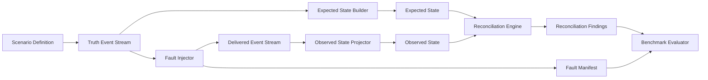

# Architecture

This document distinguishes the currently implemented `PaymentCaptured` reconciliation slices from the planned future architecture.

## Technology Status

Implemented:

- .NET 10
- C#
- xUnit

Planned and requiring future ADRs before implementation:

- PostgreSQL
- RabbitMQ with MassTransit
- OpenTelemetry
- Docker Compose
- Testcontainers
- BenchmarkDotNet

## Original Candidate Stack

The broader candidate stack remains:

- .NET 10 LTS
- C#
- PostgreSQL
- RabbitMQ with MassTransit
- OpenTelemetry
- Docker Compose
- xUnit
- Testcontainers
- BenchmarkDotNet

Implemented technologies are covered by recorded ADRs. Planned technologies require their own ADRs before implementation.

## Currently Implemented Slice

The repository currently implements narrow deterministic `PaymentCaptured` reconciliation slices:

- .NET 10 solution with Domain and Application projects.
- `Money` value object with `decimal` amount and structural validation for an ISO 4217-style three-letter uppercase currency code.
- `PaymentCaptured` event with caller-supplied event id, order id, captured amount, logical sequence, and timestamp.
- `payment-captured.v1` Scenario Definition and deterministic truth-stream generator for `PaymentCaptured` events.
- Delivered payment representation that preserves source event identity, deterministic delivery sequence, and delivery attempt.
- Expected payment projection from the clean truth event stream.
- Deterministic duplicate-delivery and missing-delivery fault injectors that return delivered streams and separate Fault Manifests.
- Non-idempotent observed payment projection for the duplicate-delivery experiment.
- Reconciliation Engine that receives only expected and observed payment snapshots.
- Logical Reconciliation Cutoff based on a shared sequence boundary for expected and observed payment projections.
- xUnit tests for the implemented slice.

The implemented slice does not include additional event types, delayed delivery faults, out-of-order delivery faults, inconsistent-amount faults, explicit missing-record finding classification, API endpoints, PostgreSQL, RabbitMQ, MassTransit, Docker, OpenTelemetry, benchmark execution, deployment support, or production-ready behavior.

## Architectural Direction

v0.1 should prefer a modular monolith with clear internal boundaries and no external infrastructure requirement. Unnecessary microservices should be avoided. Isolated processes should be introduced only when needed for a measurable experiment, such as broker behavior, persistence behavior, or repeatable benchmark execution.

Deterministic reconciliation logic must remain separate from infrastructure concerns such as message brokers, databases, telemetry, and container orchestration.

## Required Data Flow

The Reconciliation Engine must never receive or access the Fault Manifest. The Fault Manifest is test oracle data used only by tests and the Benchmark Evaluator after reconciliation completes.

## Planned Components

### Scenario Definition

The implemented `payment-captured.v1` definition contains scenario version, scenario id, unsigned seed, payment count, payment amount, starting timestamp, and event interval. Broader scenario definitions remain planned.

### Truth Event Stream Generator

Creates the clean deterministic stream of `PaymentCaptured` events from a `payment-captured.v1` Scenario Definition. Future versions may add `OrderPlaced`, `RefundIssued`, `CommissionAssessed`, and `ShippingFeeAssessed`.

### Expected State Builder

Builds Expected State from the Truth Event Stream using configured invariants and money semantics.

### Fault Injector

Transforms the Truth Event Stream into a Delivered Event Stream by injecting deterministic delivery faults. Duplicate and missing `PaymentCaptured` delivery faults are implemented. Delayed delivery, out-of-order delivery, inconsistent-amount, and broader event faults remain planned. The injector also emits the Fault Manifest for evaluation, not for reconciliation.

### Observed State Projector

Builds Observed State from the Delivered Event Stream up to the configured Reconciliation Cutoff.

### Reconciliation Engine

Compares Expected State and Observed State and produces stable Reconciliation Findings. It must not depend on the Fault Manifest, wall-clock time, real sleeps, infrastructure, or nondeterministic APIs.

### Discrepancy Classifier

Classifies differences such as missing record, duplicate financial effect, inconsistent amount, currency mismatch, timing-related drift, and unsupported state transition.

### Report Generator

Produces deterministic reconciliation reports with source-event traceability, delivered-event traceability, cutoff information, and configuration metadata.

### Benchmark Evaluator

Compares Reconciliation Findings with the Fault Manifest after reconciliation completes. It reports functional evaluation separately from performance measurements.

### Benchmark Runner

Executes configured synthetic scenarios repeatedly and records reproducibility, throughput, latency, and functional-evaluation output.

## Reconciliation Timing Semantics

v0.1 must use a logical Reconciliation Cutoff instead of real waiting or `Task.Delay`. Baseline delivered events use the source event `LogicalSequence` as `DeliverySequence`, so the same numeric sequence boundary can align Expected State built from truth events and Observed State built from delivered events in the current payment slices. Missing delivery preserves the sequence gap. Delayed delivery is represented through logical delivery ordering or delivery position. Events beyond the configured cutoff are not part of the corresponding projection for that reconciliation run. Repeated runs with the same Scenario Definition, seed, cutoff, and configuration must produce the same findings.

Independent truth and delivery timelines may require separate cutoff semantics in a future version.

## Architecture Decision Status

Recorded decisions:

- [ADR-0002](adr/0002-use-dotnet-10-and-initial-project-boundaries.md): .NET 10 and initial project boundaries.
- [ADR-0003](adr/0003-money-currency-and-rounding-semantics.md): money, currency, and rounding semantics for the current slice.
- [ADR-0004](adr/0004-deterministic-fault-injection-cutoff-and-manifest-isolation.md): deterministic fault injection, logical cutoff, and Fault Manifest isolation.
- [ADR-0005](adr/0005-versioned-deterministic-payment-scenario-generation.md): versioned deterministic `PaymentCaptured` scenario generation.
- [ADR-0006](adr/0006-deterministic-missing-delivery-fault-injection.md): deterministic missing `PaymentCaptured` delivery fault injection.

Remaining decisions required before their respective implementation:

- Persistence model and PostgreSQL usage.
- RabbitMQ and MassTransit broker integration.
- Benchmark methodology and result publication rules.
- OpenTelemetry tracing and metrics strategy.
- Other unresolved future concerns that would affect architecture, data semantics, or reproducibility.
